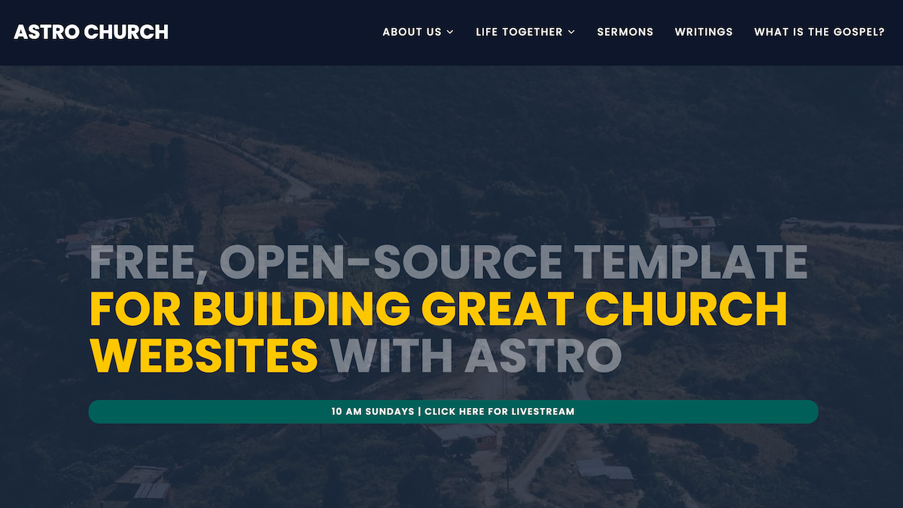

<!-- Adapted from https://github.com/othneildrew/Best-README-Template -->

<!-- BACK TO TOP -->

<a id="readme-top"></a>

# Astro Church

[](https://astro.build)
[](https://starlight.astro.build)
[](https://opensource.org/licenses/MIT)

Astro Church is a high-performance and deeply customizable theme for [**Astro**](https://astro.build/). This theme prioritizes speed, ease of use, and robust sermon organization.

---

## Why Astro Church?

Too many church websites are trapped on generic platforms that aren't built for ministry. The result? **Frustratingly slow load times, messy sermon archives, and expensive monthly fees.** Even worse, your content is often locked into a proprietary system you don't truly own.

The **Astro Church Theme** was created to break that cycle. It is a purpose-built solution designed to solve the specific digital hurdles churches face. By prioritizing speed, intuitive sermon organization, and open-source freedom, we've made it easier (and cheaper) to have a solid church website.

<p align="right">(<a href="#readme-top">back to top</a>)</p>

---

## Demo

<div align="center">

[](https://sojourners.church)



</div>

<p align="right">(<a href="#readme-top">back to top</a>)</p>

---

## ✨ Key Features

- 🆓 Completely Free: No licenses, no subscriptions, no hidden costs.
- 🧠 No coding experience required: See low-code setup in docs. Everything is configured by a settings file in the CMS.
- 🔓 Open-Source: Fully transparent code. Fork it, tweak it, and make it your own.
- 🎨 Themeable: Easily adjust colors to match your church’s branding.
- 📝 Markdown-Based Content: You own your data. All sermons, blog posts, and pages are stored as local Markdown files—no complex databases required.
- 📅 Google Calendar Integration: Keep your community updated with a live sync of your church events.
- 📧 Newsletter Ready: Built-in subscription form powered by Resend for seamless communication.
- 📰 Integrated Blog: Share updates, devotionals, and news with a fully functional blogging engine.
- 📄 Custom Pages: Easily add "About Us," "Leadership," "Beliefs," or "Location" pages.

<p align="right">(<a href="#readme-top">back to top</a>)</p>

---

## 🎙️ Powerful Sermon Management

Managing your media shouldn't be a chore. Astro Church includes a robust sermon library system:

- Smart Search: Find messages instantly by Title or Scripture reference.
- Dynamic Filtering: Filter your library by Sermon Series or Preacher.
- Multi-Platform Embedding: Seamlessly embed audio or video from Spotify or YouTube directly into sermon pages.

<p align="right">(<a href="#readme-top">back to top</a>)</p>

---

## 🚀 Quick Start

1. Create a new project

```bash
npm create astro@latest -- --template tmykkanen/astro-church
```

2. Configure your site

```bash
cp .env.example .env
# Edit .env with your information
```

3. Start development server

```bash
npm run dev
```

Your site is now running at [http://localhost:4321](http://localhost:4321)

<p align="right">(<a href="#readme-top">back to top</a>)</p>

---

## Documentation

Full documentation is available at [Astro Church Docs](https://docs-astro-church.netlify.app).

<p align="right">(<a href="#readme-top">back to top</a>)</p>

---

## Project Build Info

Built by [Tyler Mykkanen](https://github.com/tmykkanen) using:

- 
- 
- 
- 
- 
- 
- 

<p align="right">(<a href="#readme-top">back to top</a>)</p>

---

<!-- CONTRIBUTING -->

## Contributing

Contributions are what make the open source community such an amazing place to learn, inspire, and create. Any contributions you make are **greatly appreciated**.

If you have a suggestion that would make this better, please fork the repo and create a pull request. You can also simply open an issue with the tag "enhancement".
Don't forget to give the project a star! Thanks again!

1. Fork the Project
2. Create your Feature Branch (`git checkout -b feature/AmazingFeature`)
3. Commit your Changes (`git commit -m 'Add some AmazingFeature'`)
4. Push to the Branch (`git push origin feature/AmazingFeature`)
5. Open a Pull Request

<p align="right">(<a href="#readme-top">back to top</a>)</p>

---

## License

Astro Church is free for personal and commercial use under the MIT License. Attribution is not required, but a link back to this repository is always appreciated if you find the theme useful.

<p align="right">(<a href="#readme-top">back to top</a>)</p>
